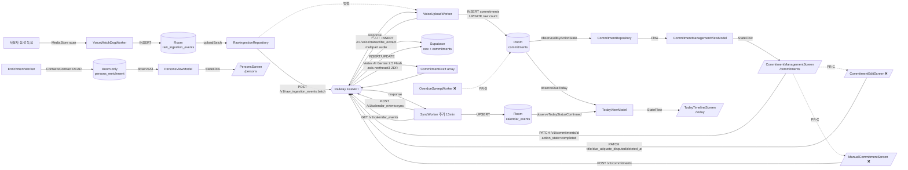

# BeCalm Android MVP — Traceability Audit (DB ↔ API ↔ UI)

**Purpose**: DB 스키마 → API 엔드포인트 → UI 화면의 end-to-end 연결을 한 문서에서 시각화하여
(1) 스펙(.spec/contracts/**)과 코드의 drift, (2) dead code, (3) 미구현 gap을 빠짐없이 식별한다.
본 문서는 PR-A ~ PR-D 실행 직전 code-alignment-plan.md의 스펙 soundness 체크포인트다.

**스냅샷 기준**: 2026-04-20 (feat/android-todo-share-auth 브랜치 / 스펙 .spec/contracts v1 최신)
**컨벤션**:
- ✅ aligned (스펙=코드 일치)
- ⚠️ drift (스펙=코드 값/타입 다름 → PR 수정 필요)
- ❌ missing (스펙에만 존재, 코드 없음 → PR 구현 필요)
- 🪦 dead (코드에만 존재, 스펙/호출자 없음 → PR 제거)

---

## Part 1. DB Schema ER Diagram (스펙 기준)

```mermaid
erDiagram
    %% ======== Supabase-mirrored (Room ↔ Railway ↔ Postgres) ========
    AUTH_USERS ||--o{ RAW_INGESTION_EVENTS : "1:N"
    AUTH_USERS ||--o{ COMMITMENTS : "1:N"
    AUTH_USERS ||--o{ CALENDAR_EVENTS : "1:N"
    AUTH_USERS ||--|| USER_PROFILE : "1:1"
    AUTH_USERS ||--o{ COMMITMENTS_EDITED : "last_edited_by SET NULL"
    COMMITMENTS ||--o{ COMMITMENTS : "supersedes_commitment_id (chain)"

    %% ======== Room-only (never uploaded) ========
    RAW_INGESTION_EVENTS ||--o| EMAIL_BODY : "raw_event_id (Room only)"

    AUTH_USERS {
        uuid id PK
        text email
    }

    RAW_INGESTION_EVENTS {
        uuid id PK
        uuid user_id FK
        uuid client_event_id "idempotency"
        text source_type "8 values"
        text source_ref
        text person_ref "phone|email|name"
        text event_title
        text event_snippet
        int duration_seconds "voice only"
        text location "calendar only"
        int commitments_extracted_count
        timestamptz timestamp
        text sync_status "pending|synced|failed|awaiting_consent"
        int retry_count
        timestamptz last_attempt_at
    }

    COMMITMENTS {
        uuid id PK
        uuid user_id FK
        text direction "give|take"
        text counterparty_raw
        text person_ref
        text title
        text description
        text quote "LEGAL-evidentiary"
        text source_event_title
        timestamptz source_event_occurred_at
        timestamptz due_at "KST +09:00"
        text due_hint "원문"
        bool due_is_approximate
        text action_state "6 values"
        text source_type "9 values inc. manual"
        text source_ref
        float confidence
        text sync_status
        timestamptz created_at
        timestamptz updated_at
        uuid last_edited_by FK
        timestamptz last_edited_at
        bool quote_disputed
        timestamptz quote_disputed_at
        timestamptz deleted_at "soft delete"
        uuid supersedes_commitment_id FK
    }

    CALENDAR_EVENTS {
        uuid id PK
        uuid user_id FK
        text source_type "google_cal|outlook_cal"
        text source_ref
        text title
        timestamptz start_at
        timestamptz end_at
        text attendees_raw
        text status "confirmed|cancelled"
        text recurring_event_id
        timestamptz original_start_at
        text sync_status
    }

    USER_PROFILE {
        uuid user_id PK_FK
        text display_name_override
        text phone_e164_self "E.164"
        text timezone "Asia/Seoul"
        text preferred_locale "ko"
        timestamptz created_at
        timestamptz updated_at
    }

    EMAIL_BODY {
        uuid id PK
        uuid raw_event_id FK
        text provider_message_id
        text folder "INBOX|SENT"
        text subject
        text from_address
        text to_addresses
        text body_plain
        text body_html
        text attachments_meta
        text raw_headers
        bool parse_failed
        bool group_email
        timestamptz received_at
    }

    PERSONS_ENRICHMENT {
        text person_ref PK
        text display_name
        text nickname
        text company
        text title
        text source_contact_id
        timestamptz last_synced_at
    }
```

### 테이블 속성 요약

| 테이블 | 저장소 | 업로드 대상 | RLS | 리텐션 |
|---|---|---|---|---|
| `raw_ingestion_events` | Room + Supabase | Railway batch | ✅ | 30일(클라) / 60일(서버) |
| `commitments` | Room + Supabase | Railway batch + PATCH + POST | ✅ | action_state 기준 별도 |
| `calendar_events` | Room + Supabase | Railway sync | ✅ | 별도 (status=cancelled soft-keep) |
| `user_profile` | Room + Supabase | Railway GET/PATCH | ✅ | 계정 삭제 시 cascade |
| `email_body` | **Room only** | 절대 금지 (PIPA) | n/a | 30일 rolling |
| `persons_enrichment` | **Room only** | 절대 금지 (PIPA) | n/a | 로그아웃 시 전체 삭제 |

---

## Part 2. Schema ↔ API Endpoint Mapping

각 테이블이 어느 Railway 엔드포인트에서 R/W되는지 명시. 읽기(R) / 쓰기(W) / 업데이트(U) / 삭제(D) 표기.

### 2.1 `raw_ingestion_events`

| Endpoint | Method | R/W | Spec refs |
|---|---|---|---|
| `/v1/raw_ingestion_events:batch` | POST | **W** (INSERT upsert via client_event_id) | ING-003..005, ING-011..013, SYNC-001..006 |
| `/v1/voice/transcribe_extract` | POST | **W** (upsert + sets commitments_extracted_count) | VOI-001..007 |
| `/v1/persons/{person_id}/events` | GET | **R** (filter by user_id + person_ref) | SRC-002 |

### 2.2 `commitments`

| Endpoint | Method | R/W | Spec refs |
|---|---|---|---|
| `/v1/commitments` | GET | **R** (list) | TDY-004, CMT-010 |
| `/v1/commitments/{id}` | GET | **R** (single) | CMT-003 |
| `/v1/commitments` | POST | **W** (manual + supersede) | MAN-003, EDIT-007 |
| `/v1/commitments/{id}` | PATCH | **U** (action_state + title + due_* + quote_disputed + deleted_at) | CMT-005..007, CMT-011..013, EDIT-003, EDIT-005, EDIT-006 |
| `/v1/voice/transcribe_extract` | POST (indirect) | **W** (INSERT from extraction) | VOI-002, VOI-003 |
| `/v1/persons/{person_id}/commitments` | GET | **R** | SRC-002 |

### 2.3 `calendar_events`

| Endpoint | Method | R/W | Spec refs |
|---|---|---|---|
| `/v1/calendar_events` | GET | **R** (list, optional status filter) | TDY-005, ING-009, ING-010 |
| `/v1/calendar_events:sync` | POST | **W** (server-side Google/Outlook pull) | TDY-005 |

### 2.4 `user_profile`

| Endpoint | Method | R/W | Spec refs |
|---|---|---|---|
| `/v1/user_profile` | GET | **R** | PIPA-001, VOI-008 |
| `/v1/user_profile` | PATCH | **U** (display_name_override, phone_e164_self, timezone, preferred_locale) | PIPA-001, VOI-008 |

### 2.5 `email_body` / `persons_enrichment` (Room-only)

**No Railway endpoints** — PIPA invariant로 서버 전송 금지.
- `email_body`: EmailProcessor가 raw_ingestion_events INSERT와 트랜잭션 동일 스코프에서 Room에 저장. Jsoup 파싱은 온디바이스.
- `persons_enrichment`: EnrichmentWorker가 ContactsContract에서 채움. person_ref는 JOIN key로만 로컬 사용.

### 2.6 Persons (virtual grouping)

`persons` 테이블은 MVP DB에 없음. Railway `/v1/persons*` 3개는 Railway 서버 측에서 commitments + raw_ingestion_events의 person_ref를 GROUP BY하는 가상 응답.

---

## Part 3. API Endpoint ↔ UI Screen Mapping

각 엔드포인트가 어떤 ViewModel/Screen에서 호출되는지 실제 코드 consumer까지 추적.

### 3.1 Supabase Auth

| Endpoint | ui-map 선언 화면 | 실제 호출자 (코드) | 정합성 |
|---|---|---|---|
| `POST /auth/v1/token` | `/login` | `AuthViewModel` | ✅ |
| `POST /auth/v1/logout` | `/settings` | `SettingsViewModel` | ✅ |

### 3.2 Railway — Raw Ingestion

| Endpoint | ui-map 선언 화면 | 실제 호출자 (코드) | 정합성 |
|---|---|---|---|
| `POST /v1/raw_ingestion_events:batch` | (백그라운드) | `RawIngestionRepository.uploadBatch` ← `SyncWorker` / `ColdSyncOrchestrator`(❌ 미구현) | ⚠️ Repository는 있으나 ColdSyncOrchestrator 미구현 |
| `POST /v1/voice/transcribe_extract` | (백그라운드) | `VoiceUploadWorker.doWork` ← `VoiceApi.transcribeExtract` | ✅ |

### 3.3 Railway — Commitments

| Endpoint | ui-map 선언 화면 | 실제 호출자 (코드) | 정합성 |
|---|---|---|---|
| `GET /v1/commitments` | `/today`, `/commitments` | `CommitmentRepository.refreshFromServer` ← `TodayViewModel`, `CommitmentManagementViewModel` | ⚠️ `include_deleted` 쿼리 파라미터 누락 |
| `GET /v1/commitments/{id}` | (상세 조회) | `CommitmentRepository.fetchOne` | ✅ |
| `PATCH /v1/commitments/{id}` | `/commitments` | `CommitmentRepository.updateActionState` ← `CommitmentManagementViewModel` | ⚠️ body에 action_state만 전송, title/due_*/quote_disputed/deleted_at 없음 |
| `POST /v1/commitments` | `/commitments/manual`(❌), `/commitments/{id}/edit`(❌) | **없음** — RailwayApi 인터페이스에도 미정의 | ❌ PR-B에서 구현 |

### 3.4 Railway — Calendar

| Endpoint | ui-map 선언 화면 | 실제 호출자 (코드) | 정합성 |
|---|---|---|---|
| `GET /v1/calendar_events` | `/today` | `CalendarEventRepository.refreshFromServer` ← `TodayViewModel` | ⚠️ `status` 쿼리 파라미터 누락 |
| `POST /v1/calendar_events:sync` | (백그라운드) | `CalendarEventRepository.triggerSync` ← `SyncWorker` | ✅ |

### 3.5 Railway — Persons (가상)

| Endpoint | ui-map 선언 화면 | 실제 호출자 (코드) | 정합성 |
|---|---|---|---|
| `GET /v1/persons` | `/persons` | **없음** (`PersonsViewModel`는 로컬 `PersonEnrichmentRepository`+`RawIngestionRepository`만 사용) | 🪦 **dead code** (선언됨, 호출 없음) |
| `GET /v1/persons/{id}/events` | `/persons/{person_id}` | **없음** (`PersonDetailViewModel`는 로컬만 사용) | 🪦 **dead code** |
| `GET /v1/persons/{id}/commitments` | `/persons/{person_id}` | **없음** | 🪦 **dead code** |

**판단**: MVP 전략상 `/persons*`는 로컬 person_ref GROUP BY로 충분(CONTACTS enrichment 포함). Railway 측 가상 persons는 post-MVP의 다기기 동기화 시나리오 대비 유보. PR-B에서 **RailwayApi의 3개 메서드를 제거**하거나 **`@Deprecated` 주석으로 post-MVP 유보 표시**가 옵션. 스펙(api-contract.yml)과 일치시키려면 남겨두고, 호출 부재 상태를 PR-B README에 명시한다.

### 3.6 Railway — User Profile

| Endpoint | ui-map 선언 화면 | 실제 호출자 (코드) | 정합성 |
|---|---|---|---|
| `GET /v1/user_profile` | `/settings` (→ 내 프로필 subscreen 예정) | **없음** — `RailwayApi`에 메서드 미정의 | ❌ PR-B에서 구현 |
| `PATCH /v1/user_profile` | `/settings` (phone 입력 시) | **없음** | ❌ PR-B에서 구현 |

---

## Part 4. Unified End-to-End Flow

사용자 오디오 한 건이 ToadyTimelineScreen / CommitmentManagementScreen까지 흐르는 전체 경로:



### Flow 주요 invariant
1. **Single writer to Supabase**: Android → Railway → Supabase. Android에서 `supabase-kt` 데이터 쓰기 금지.
2. **client_event_id idempotency**: Android 생성 UUID v4로 raw_ingestion_events upsert dedupe.
3. **Voice pipeline은 transcript를 저장하지 않음**: Railway 요청 lifetime 안에서만 존재.
4. **EmailBody + persons_enrichment는 절대 서버 전송 금지** (PIPA).
5. **deleted_at IS NULL은 DAO 레벨에서 모든 리스트 쿼리에 기본 적용** — PR-A에서 일괄 추가.

---

## Part 5. Drift List — 스펙 vs 코드 불일치 (PR-A 대상)

### 5.1 Entity-level drift

#### `CommitmentEntity.kt`

| 항목 | 스펙 | 현재 코드 | 액션 |
|---|---|---|---|
| `due_date: LocalDate?` | **없음** (삭제됨) | 존재 (line 114) | ⚠️ 삭제 |
| `due_at: Instant?` | ✅ timestamptz, KST payload | **없음** | ❌ 추가 |
| `due_hint: String?` | ✅ LLM 원문 | **없음** | ❌ 추가 |
| `due_is_approximate: Boolean` | ✅ default false | **없음** | ❌ 추가 |
| `commitment_state: String` | **없음** (SP-36 제거) | `commitmentState: CommitmentState (DEFAULT 'DRAFT')` (line 128) | 🪦 삭제 |
| `action_state` 주석 | `pending \| reminded \| followed_up \| completed \| overdue \| cancelled` | `pending \| reminded \| followed_up \| completed`만 문서화 | ⚠️ 주석 갱신 |
| `last_edited_by: String?` | ✅ FK auth.users SET NULL | **없음** | ❌ 추가 |
| `last_edited_at: Instant?` | ✅ | **없음** | ❌ 추가 |
| `quote_disputed: Boolean` | ✅ default false | **없음** | ❌ 추가 |
| `quote_disputed_at: Instant?` | ✅ | **없음** | ❌ 추가 |
| `deleted_at: Instant?` | ✅ soft delete | **없음** | ❌ 추가 |
| `supersedes_commitment_id: String?` | ✅ FK self | **없음** | ❌ 추가 |
| `idx_commitments_user_action_due` | due_at 기준 | due_date 기준 | ⚠️ 재작성 |
| `idx_commitments_user_person_due` | due_at 기준 | due_date 기준 | ⚠️ 재작성 |
| `idx_commitments_user_deleted` | ✅ 신규 | **없음** | ❌ 추가 |
| `idx_commitments_supersedes` | ✅ 신규 | **없음** | ❌ 추가 |

#### `CalendarEventEntity.kt`

| 항목 | 스펙 | 현재 코드 | 액션 |
|---|---|---|---|
| `status: String` | `confirmed \| cancelled` default 'confirmed' | **없음** | ❌ 추가 |
| `recurring_event_id: String?` | ✅ | **없음** | ❌ 추가 |
| `original_start_at: Instant?` | ✅ | **없음** | ❌ 추가 |
| `idx_calendar_events_user_status_start` | 복합 인덱스 | **없음** | ❌ 추가 |
| `idx_calendar_events_user_recurring` | 복합 인덱스 | **없음** | ❌ 추가 |

#### `RawIngestionEventEntity.kt`

| 항목 | 스펙 | 현재 코드 | 액션 |
|---|---|---|---|
| `source_type` 주석 | 8종 (voice/call_recording/gmail/outlook_mail/naver_imap/daum_imap/google_calendar/outlook_calendar) | `call_recording` 누락 | ⚠️ 주석 갱신 |
| 기타 컬럼/인덱스 | 전부 일치 | | ✅ |

#### `UserProfileEntity.kt`

| 항목 | 스펙 | 현재 코드 | 액션 |
|---|---|---|---|
| 엔티티 파일 자체 | ✅ (Part 1 ER 참조) | **존재 확인 필요** (PR-A에서 검증) | ⚠️ (미확인 — 추후 검증) |

#### `EmailBodyEntity.kt`

| 항목 | 스펙 | 현재 코드 | 액션 |
|---|---|---|---|
| `raw_headers` | ✅ In-Reply-To, References 헤더 | **존재 확인 필요** | ⚠️ |
| `parse_failed` / `group_email` | ✅ | **존재 확인 필요** | ⚠️ |

#### `PersonEnrichmentEntity.kt`

| 항목 | 스펙 | 현재 코드 | 액션 |
|---|---|---|---|
| 전체 | PIPA on-device only | ✅ 일치 | ✅ |

### 5.2 Repository-level drift

#### `CommitmentRepository.kt`

| 항목 | 스펙 | 현재 코드 | 액션 |
|---|---|---|---|
| `ALLOWED_ACTION_STATES` | 6종 (+`overdue`, `cancelled`) | 4종만 (line 35) | ⚠️ 확장 |
| `applyEvent()` / `transitionState()` / `CommitmentStateMachine` 호출 | **없음** | 존재 (line 294-322) | 🪦 삭제 |
| `actionStateToLifecycleEvent()` 바인딩 | **없음** | 존재 (line 391-398) | 🪦 삭제 |
| `toEntity()` 매퍼에서 commitmentState 처리 | **없음** | 현재 누락 (line 462 — silent DRAFT default) | 🪦 정리 (엔티티에서 컬럼 제거) |
| `editFields()` (title/due_at/due_hint/due_is_approximate/person_ref/direction) | ✅ (EDIT-003, EDIT-004) | **없음** | ❌ 추가 |
| `markQuoteDisputed()` | ✅ (EDIT-005) | **없음** | ❌ 추가 |
| `softDelete()` | ✅ (EDIT-006) | **없음** | ❌ 추가 |
| `supersede()` | ✅ (EDIT-007) | **없음** | ❌ 추가 |
| `saveManualCommitment()` | ✅ (MAN-003) | **없음** | ❌ 추가 |
| `listActive()` / `observeActiveByFilter()` — `WHERE deleted_at IS NULL` | ✅ DAO 레벨 일괄 적용 | **없음** | ❌ 추가 |

#### `CalendarEventRepository.kt`

| 항목 | 스펙 | 현재 코드 | 액션 |
|---|---|---|---|
| `observeTodayConfirmed()` (status='confirmed' 분리) | ✅ | **없음** (status 컬럼 자체 없음) | ❌ PR-A 엔티티 추가 후 PR-C에서 |
| `markCancelled()` (DELETE 대신 UPDATE) | ✅ (ING-009, ING-010) | **미확인** | ⚠️ ING adapter 검증 필요 |

### 5.3 API interface drift

#### `RailwayApi.kt`

| 항목 | 스펙 | 현재 코드 | 액션 |
|---|---|---|---|
| `GET /v1/commitments` — `include_deleted?: bool` 쿼리 | ✅ | 없음 | ⚠️ 추가 |
| `PATCH /v1/commitments/{id}` body | title/due_at/due_hint/due_is_approximate/person_ref/direction/quote_disputed/deleted_at/last_edited_at 필드 | `PatchCommitmentRequest`에 `actionState` 단일 필드만 | ⚠️ DTO 확장 |
| `POST /v1/commitments` | ✅ 명시 | **없음** | ❌ 추가 |
| `GET /v1/user_profile` | ✅ | **없음** | ❌ 추가 |
| `PATCH /v1/user_profile` | ✅ | **없음** | ❌ 추가 |
| `GET /v1/calendar_events` — `status?: string` 쿼리 | ✅ | 없음 | ⚠️ 추가 |

### 5.4 ui-map.yml vs Routes.kt drift

| 라우트 | ui-map | Routes.kt | 액션 |
|---|---|---|---|
| `/onboarding/pipa-consent` | **없음** | `OnboardingPipaConsent` 존재 | ⚠️ ui-map에 추가 (문서 드리프트) |
| `/commitments/{id}/edit` | **없음** | **없음** | ❌ 양쪽 추가 (EDIT 스펙 반영) |
| `/commitments/manual` | **없음** | **없음** | ❌ 양쪽 추가 (MAN 스펙 반영) |
| `/settings/pipa-rights` | **없음** | **없음** | ❌ 양쪽 추가 (PIPA-003 열람권 반영, 해당 시) |
| `/settings/profile` | **없음** | **없음** | ❌ 양쪽 추가 (user_profile UI 진입점) |
| `/onboarding/cold-sync` | `ColdSyncScreen` | `OnboardingColdSync` | ✅ |
| 기타 17개 (auth/onboarding/today/persons/commitments/settings) | 선언 | 선언 | ✅ |

**현재 ui-map.yml 실제 라우트 수**: 21 (헤더 주석은 22라고 적혀 있으나 실제 22 entry 아님 — R1-03 참조, PR-C에서 바로잡음).

### 5.5 ViewModel / UI drift

| 항목 | 스펙 | 현재 코드 | 액션 |
|---|---|---|---|
| `PersonDetailViewModel.InteractionRow.Commitment.commitmentState` (line 64, 237) | **없음** | SP-36 residue | 🪦 삭제 (action_state로 대체) |
| `PersonDetailViewModel.buildInteractions` partition (line 247) | `action_state in (completed, cancelled)` 기준 | `commitmentState in (DONE, DISMISSED)` 기준 | 🪦 다시 작성 |
| `CommitmentManagementViewModel.derivedStatus` | action_state 기반 | `commitmentState.name` 전달 | 🪦 다시 작성 |
| `TodayViewModel.observeTodayCalendarEvents` | status='confirmed' 우선 + cancelled strike-through | status 컬럼 미존재로 전체 반환 | ❌ PR-A 후 PR-C |
| `CommitmentCard` / `CommitmentItem` 렌더링 | due_at (KST HH:mm) + due_hint + DNBadge | due_date 기반 | ⚠️ PR-C |

---

## Part 6. Dead Code Inventory (🪦 PR-A에서 제거)

### 6.1 SP-36 Commitment Lifecycle FSM

**삭제 대상 파일** (스펙에 어떤 참조도 없고 action_state가 역할을 대체):

| 파일 | Line | 삭제 이유 |
|---|---|---|
| `domain/commitment/CommitmentState.kt` | 전체 | 5상태 FSM(DRAFT/CONFIRMED/SCHEDULED/DONE/DISMISSED) — action_state와 중복 |
| `domain/commitment/CommitmentStateMachine.kt` | 전체 | 순수 전이 함수 — 호출 경로 제거 후 무용 |
| `domain/commitment/CommitmentEvent.kt` | 전체 | sealed interface (Confirm/Schedule/MarkDone/Dismiss/ReopenFromDone) |
| `domain/commitment/TransitionError.kt` | 전체 | FSM 전이 오류 타입 |

**수정 대상** (제거 후 대체 구현):

| 파일 | Line | 작업 |
|---|---|---|
| `data/local/db/entity/CommitmentEntity.kt` | 128 | `commitment_state` 컬럼 제거 |
| `data/repository/CommitmentRepository.kt` | 294-322 | `applyEvent`/`transitionState` 제거 |
| `data/repository/CommitmentRepository.kt` | 324-379 | `updateActionState` 간소화 — lifecycle coupling 제거 |
| `data/repository/CommitmentRepository.kt` | 391-398 | `actionStateToLifecycleEvent` 제거 |
| `data/repository/CommitmentRepository.kt` | 462 | `toEntity()` 매퍼에서 commitmentState 참조 제거 |
| `ui/persons/PersonDetailViewModel.kt` | 59-65, 231-239, 246-249 | `InteractionRow.Commitment.commitmentState` 필드 삭제, partition 로직을 `action_state in (completed, cancelled)` 로 변경 |
| `ui/commitments/CommitmentManagementViewModel.kt` | `derivedStatus` | action_state 기반으로 재작성 |

### 6.2 Railway Persons 엔드포인트 (판단 필요)

| 파일 | Line | 상태 | 권고 |
|---|---|---|---|
| `data/remote/api/RailwayApi.kt` | 187 `getPersons` | 호출자 없음 (PersonsViewModel은 로컬) | MVP에는 사용 안 됨 — 남기되 `@Deprecated("post-MVP server-backed persons")` 주석 추가 또는 PR-B 스콥에서 제거 |
| `data/remote/api/RailwayApi.kt` | 205 `getPersonEvents` | 호출자 없음 | 동일 |
| `data/remote/api/RailwayApi.kt` | 223 `getPersonCommitments` | 호출자 없음 | 동일 |
| `data/remote/dto/PersonDtos.kt` | 전체 | DTO 미사용 | 엔드포인트와 함께 판단 |

**권고**: 스펙(api-contract.yml)이 엔드포인트를 명시했으므로 **인터페이스와 DTO는 유지**, 다만 `CHANGELOG.md` 혹은 PR-B README에 "현재 호출자 없음 — post-MVP 다기기/서버 persons 시나리오 유보" 명시. 코드 삭제는 하지 않음 → 🪦 → ⚠️ 로 downgrade.

---

## Part 7. Gap List — 스펙 존재, 코드 미구현 (❌ PR-B / PR-C / PR-D)

### 7.1 엔티티/Repository (PR-A)

- `CommitmentEntity`: due_at/due_hint/due_is_approximate + 6개 편집/증거 컬럼 (last_edited_by/at, quote_disputed/at, deleted_at, supersedes_commitment_id)
- `CalendarEventEntity`: status, recurring_event_id, original_start_at + 2개 신규 인덱스
- `CommitmentRepository` 신규 메서드: editFields, markQuoteDisputed, softDelete, supersede, saveManualCommitment, listActive

### 7.2 API (PR-B)

- `POST /v1/commitments` (manual + supersede) — RailwayApi 메서드 추가
- `PatchCommitmentRequest` DTO 확장 (title, due_at, due_hint, due_is_approximate, person_ref, direction, quote_disputed, deleted_at, last_edited_at)
- `GET /v1/commitments?include_deleted=...` 쿼리 파라미터
- `GET /v1/calendar_events?status=...` 쿼리 파라미터
- `GET /v1/user_profile` + `PATCH /v1/user_profile` — 신규 RailwayApi 섹션

### 7.3 UI (PR-C)

- `CommitmentEditScreen` (title/due_at/due_hint/person_ref/direction/quote_disputed 편집) — `/commitments/{id}/edit`
- `ManualCommitmentScreen` (direction/title/quote/due_at 사용자 입력) — `/commitments/manual`
- `PipaRightsScreen` (PIPA 열람권/삭제권) — `/settings/pipa-rights` (해당 behavior spec 존재 시)
- `UserProfileScreen` (phone_e164_self 입력, display_name_override) — `/settings/profile`
- `SourceStatusStrip` cancelled 이벤트 strike-through 렌더링 (TDY-001)
- `OverallSyncIndicator` 4상태 표시 (TDY-008)

### 7.4 Workers (PR-D)

- `OverdueSweepWorker` — 일일 스윕, due_at < now()-24h + action_state ∈ {pending, reminded} → `overdue`
- `ColdSyncOrchestrator` — 최초 온보딩 완료 후 6소스 병렬 catch-up (COLD-001..008)
- `RetentionSweepWorker` 검증 — 30일 rolling window on raw_ingestion_events (synced만)

### 7.5 Backend (PR-E — becalm-backend 레포)

- Railway FastAPI: 위 API 엔드포인트 전부 (Android 클라이언트가 보낼 payload schema와 일치)
- Supabase migrations `001_initial.sql` (단일 파일 — 기존 배포 없음)
- RLS 정책 (user_id 격리 + last_edited_by SET NULL)
- pg_cron 서버 리텐션 60일

---

## Part 8. Consolidated Action Checklist (PR-A / B / C / D / E)

### PR-A: Schema Rebuild + SP-36 Removal (현재 브랜치)

**커밋 1 — refactor(commitment): remove SP-36 FSM**
- [ ] `domain/commitment/CommitmentState.kt` 삭제
- [ ] `domain/commitment/CommitmentStateMachine.kt` 삭제
- [ ] `domain/commitment/CommitmentEvent.kt` 삭제
- [ ] `domain/commitment/TransitionError.kt` 삭제
- [ ] `CommitmentRepository`에서 applyEvent/transitionState/actionStateToLifecycleEvent 제거
- [ ] `PersonDetailViewModel`에서 commitmentState 필드 제거 + partition 로직 action_state 기반 전환
- [ ] `CommitmentManagementViewModel.derivedStatus`를 action_state 기반으로 재작성
- [ ] `ALLOWED_ACTION_STATES`에 `overdue`, `cancelled` 추가

**커밋 2 — feat(db): commitments schema (due_at triplet + edit columns)**
- [ ] `CommitmentEntity`에서 `due_date` 제거, `due_at/due_hint/due_is_approximate` 추가
- [ ] `CommitmentEntity`에 `commitment_state` 제거, 6개 편집/증거 컬럼 추가
- [ ] `CommitmentDao` 쿼리를 `deleted_at IS NULL` 기본 필터로 일괄 수정
- [ ] 인덱스 재작성: `idx_commitments_user_action_due` (due_at), `idx_commitments_user_person_due` (due_at), `idx_commitments_user_deleted`, `idx_commitments_supersedes`

**커밋 3 — feat(db): calendar_events status + recurring**
- [ ] `CalendarEventEntity`에 `status/recurring_event_id/original_start_at` 추가
- [ ] `idx_calendar_events_user_status_start`, `idx_calendar_events_user_recurring` 추가

**커밋 4 — chore(db): version bump + destructive fallback**
- [ ] `DATABASE_VERSION = 4` 승격
- [ ] `fallbackToDestructiveMigration()` 활성 (미배포 상태 전제 — CTO 승인)
- [ ] `README.md` / PR 설명에 destructive fallback 사용 이유 + MVP 미배포 상태 명기

### PR-B: Repository + API Expansion (PR-A 위에 stack)

- [ ] `CommitmentRepository.editFields()` + `.markQuoteDisputed()` + `.softDelete()` + `.supersede()` + `.saveManualCommitment()` + `.listActive()`
- [ ] `PatchCommitmentRequest` DTO 9개 필드 확장
- [ ] `CreateCommitmentRequest` DTO 신규 + `RailwayApi.createCommitment()`
- [ ] `UserProfileDto` + `UpdateUserProfileRequest` + `RailwayApi.getUserProfile()` + `.patchUserProfile()`
- [ ] `RailwayApi.getCommitments(include_deleted)` 시그니처 확장
- [ ] `RailwayApi.getCalendarEvents(status)` 시그니처 확장
- [ ] `CalendarEventRepository.observeTodayConfirmed()` / `.markCancelled()`

### PR-C: UI (PR-B 위에 stack)

- [ ] `CommitmentEditScreen` + ViewModel + route `/commitments/{id}/edit`
- [ ] `ManualCommitmentScreen` + ViewModel + route `/commitments/manual`
- [ ] `UserProfileScreen` + ViewModel + route `/settings/profile`
- [ ] (선택) `PipaRightsScreen` — 해당 behavior spec 유무 확인 후 판단
- [ ] `TodayTimelineScreen` — cancelled event strike-through 렌더링
- [ ] `CommitmentCard` / `CommitmentItem` — due_at/due_hint/DNBadge 표시
- [ ] `CommitmentManagementScreen` — filter tabs + overdue/cancelled 상태 배지
- [ ] `Routes.kt` + `BecalmNavHost` 확장
- [ ] `ui-map.yml` 동기화 (PIPA consent 추가 + 신규 화면 반영 + 22 route 정확성 바로잡기)

### PR-D: Workers (PR-C와 병렬 가능)

- [ ] `OverdueSweepWorker` (일 1회, due_at 기반 스윕)
- [ ] `ColdSyncOrchestrator` (COLD-001..008 구현)
- [ ] `RetentionSweepWorker` 스펙 검증 (30일 rolling, synced only)

### PR-E: Backend (별도 세션, becalm-backend 레포)

- [ ] FastAPI 엔드포인트 12개 (Android 스펙 일치)
- [ ] Supabase `001_initial.sql` (6 tables + 6 relationships + RLS + 인덱스)
- [ ] Vertex AI Gemini 2.5 Flash 연동 (asia-northeast3 + ZDR) — `prompts/commitment_extractor.ko.md`
- [ ] pg_cron 서버 리텐션 60일

### 공통 post-PR 검증

- [ ] `./gradlew testDebugUnitTest` 전부 green
- [ ] `./gradlew lintDebug` deprecation / unused-import 경고 0
- [ ] `ui-map.yml` route 수 == `Routes.kt` sealed 멤버 수
- [ ] 엔티티 ↔ DAO ↔ Repository ↔ Remote DTO 레이어 각 필드 1:1 대응

---

## 부록 A. 스펙 파일 레지스트리

PR 설계 시 참조하는 모든 behavior spec (해당 엔티티·엔드포인트·화면과 교차).

| Spec ID | 파일 | 관련 테이블 | 관련 API | 관련 화면 |
|---|---|---|---|---|
| ING-003..013 | data-ingestion.spec.yml | raw_ingestion_events, calendar_events | batch, calendar sync | (백그라운드) |
| VOI-001..008 | voice-pipeline.spec.yml | raw_ingestion_events, commitments | transcribe_extract | (백그라운드) |
| EMAIL-001..007 | email-pipeline.spec.yml | raw_ingestion_events, email_body | batch | (백그라운드) |
| SYNC-001..006 | background-sync.spec.yml | raw_ingestion_events | batch | (백그라운드) |
| TDY-001..010 | today-timeline.spec.yml | commitments, calendar_events | GET commitments, GET calendar_events | /today |
| CMT-003..013 | commitment-management.spec.yml | commitments | GET/PATCH commitments | /commitments |
| EDIT-001..008 | commitment-edit.spec.yml | commitments | PATCH, POST (supersede) | /commitments/{id}/edit |
| MAN-001..006 | manual-commitment.spec.yml | commitments | POST commitments | /commitments/manual |
| SRC-001..008 | persons.spec.yml | commitments, raw_ingestion_events, persons_enrichment | (로컬) | /persons, /persons/{id} |
| ENR-001..008 | contacts-enrichment.spec.yml | persons_enrichment | (로컬) | /onboarding/contacts |
| AUTH-001..008 | authentication.spec.yml | user_profile | supabase auth | /login, /splash |
| ONB-001..008 | onboarding.spec.yml | user_profile, raw_ingestion_events | auth + user_profile | /onboarding/* |
| ONB-PIPA | onboarding.spec.yml | (DataStore) | - | /onboarding/pipa-consent |
| PIPA-001..003 | pipa.spec.yml | user_profile | user_profile | /settings/profile, /settings/pipa-rights |
| COLD-001..008 | cold-sync.spec.yml | all | batch, calendar sync | /onboarding/cold-sync |
| SMG-001..005 | source-management.spec.yml | (DataStore) | (로컬) | /settings/sources, /settings/sources/{id} |
| ERR-001..008 | error-recovery.spec.yml | raw_ingestion_events.sync_status | - | (전역) |

**누락 확인 필요**: `pipa.spec.yml`이 실제 존재하는지, PIPA 열람권·삭제권 behavior가 명시되어 있는지 PR-C 시작 전 검증.

---

## Part 9. Finding PR Index (Live)

> **이 섹션은 다른 구현 세션의 진입점이다.** 각 row는 하나의 열린 PR. 구현 세션은 해당 branch를 checkout → `docs/plans/<layer>-<module>-<logic>.md`를 읽고 시작.

### 네이밍 규칙 (3-level — module 까지)

`{type}/{layer}/{module}` — **logic suffix 금지**. logic 세분화는 commit 단위.

- **type**: `feat` | `fix` | `refactor` — 브랜치의 *첫* commit 성격 기준. 이후 다른 type 의 commit 이 같은 브랜치에 쌓여도 OK.
- **layer**: `db` | `worker` | `ui` | `repo` | `domain` | `docs`
- **module**: `voice` | `commitment` | `person` | `calendar` | `auth` | `onboarding` | `sms` | …
- **logic**: **파일명에만** 존재 — `docs/plans/<layer>-<module>-<logic>.md` 로 누적. commit 메시지는 `{type}({layer}/{module}): <logic-slug> — …`.

**운영 원칙**:
1. 같은 `{layer}/{module}` 에 새 finding → 기존 branch 에 commit push. 새 branch 금지.
2. PR 은 구현 완료 후 CTO merge 까지 **닫지 않는다**. 열린 PR 에 plan doc + 후속 commit 누적.
3. PR 이 merge/close 된 경우에만 같은 이름의 새 branch 재개방 가능.
4. 파일 겹침은 같은 브랜치 안이면 linear stack 으로 자연 해소. 서로 다른 모듈 간 겹침만 merge 순서 매트릭스에 등록.
5. 병렬 세션은 `git worktree add ../becalm-<layer>-<module>` 로 모듈당 1 worktree.

**기존 4-level 브랜치 (#12~#21) migration 정책**: 이미 열린 PR 은 그대로 진행 (merge/close 시 같은 layer/module 의 후속 finding 은 3-level 브랜치로 재개방). 새 Stage (5 이후) 의 finding 은 처음부터 3-level 로 개방.

### E2E Stages (audit 진행 기준)

| # | Stage | Spec refs | 상태 |
|---|-------|-----------|------|
| 1 | 사용자 음성 녹음 (MediaStore watch) | VOI-005, ING-001, ONB-002/003 | 🔍 findings opened |
| 2 | 업로드 (VoiceUploadWorker → Railway multipart) | VOI-001/002/004/006/007 | 🔍 findings opened |
| 3 | Railway + Vertex AI 추출 | VOI-003 | 🔍 findings opened (Android side: #19. Railway 서버 측 감사는 별도 세션) |
| 4 | Room commitments INSERT | ING 응답 처리 | 🔍 findings opened |
| 5 | CommitmentManagement 화면 렌더 | CMT-001~013 | 🔍 findings opened (umbrella PR #22) |
| 6 | Today timeline 집계 | TDY-001~010 | ⏳ pending |
| 7 | 캘린더 sync | SYNC-001~006 | ⏳ pending |
| 8 | Person enrichment | ENR-001~008 | ⏳ pending |

### Open Finding PRs

| PR | Branch | Stage | Layer/Module | Plan doc | Status |
|---|--------|-------|--------------|----------|--------|
| [#11](https://github.com/without2026/becalm-android/pull/11) | `feat/docs/traceability-audit` | — | docs | 이 문서 + `_template.md` | 🚧 in review (this PR) |
| [#12](https://github.com/without2026/becalm-android/pull/12) | `feat/db/voice/call-recording-enum` | 1 | db/voice | `docs/plans/db-voice-call-recording-enum.md` | 🟢 open — plan only |
| [#13](https://github.com/without2026/becalm-android/pull/13) | `refactor/worker/sms/remove-dead-code` | 1 | worker/sms | `docs/plans/worker-sms-remove-dead-code.md` | 🟢 open — plan only |
| [#14](https://github.com/without2026/becalm-android/pull/14) | `refactor/worker/voice/ingestion-realign` | 1 | worker/voice | `docs/plans/worker-voice-ingestion-realign.md` | 🟢 open — plan only |
| [#15](https://github.com/without2026/becalm-android/pull/15) | `feat/worker/voice/call-recording` | 1 | worker/voice | `docs/plans/worker-voice-call-recording.md` | 🟢 open — plan only (blocked by #12, #14) |
| [#16](https://github.com/without2026/becalm-android/pull/16) | `fix/repo/voice/commitment-source-type-inherit` | 2 | repo/voice | `docs/plans/repo-voice-commitment-source-type-inherit.md` | 🟢 open — plan only (blocked by #12 for test enum) |
| [#17](https://github.com/without2026/becalm-android/pull/17) | `feat/db/commitment/due-at-hint-approximate` | 2 | db/commitment | `docs/plans/db-commitment-due-at-hint-approximate.md` | 🟢 open — plan only (largest PR — 15 file ripple) |
| [#18](https://github.com/without2026/becalm-android/pull/18) | `fix/worker/voice/pipa-insert-status` | 2 | worker/voice | `docs/plans/worker-voice-pipa-insert-status.md` | 🟢 open — plan only (tiny, 1 file) |
| [#19](https://github.com/without2026/becalm-android/pull/19) | `fix/worker/voice/retry-after-honor` | 3 | worker/voice | `docs/plans/worker-voice-retry-after-honor.md` | 🟢 open — plan only (3 files, UploadBackoff 재사용) |
| [#20](https://github.com/without2026/becalm-android/pull/20) | `feat/db/commitment/edit-delete-dispute-supersede` | 4 | db/commitment | `docs/plans/db-commitment-edit-delete-dispute-supersede.md` | 🟢 open — plan only (migration 4→5, 6 컬럼 + 2 인덱스, DAO `WHERE deleted_at IS NULL` 전수 적용) |
| [#21](https://github.com/without2026/becalm-android/pull/21) | `feat/repo/commitment/source-type-manual` | 4 | repo/commitment | `docs/plans/repo-commitment-source-type-manual.md` | 🟢 open — plan only (1 파일, `MANUAL` enum 상수 추가. #12 과 동일 파일 — 순차 merge) |
| [#22](https://github.com/without2026/becalm-android/pull/22) | `feat/ui/commitment` | 5 | ui/commitment | **umbrella** — `docs/plans/ui-commitment-*.md` 누적 (dn-badge-kst, action-state-alignment, …) | 🟢 open — plan only (3-level 첫 적용. Stage 5 UI drift 전체가 이 branch 에 누적) |

### Merge 순서 권장

1. `#11` (landing — 이 문서 + 템플릿 merge)
2. `#12` (CALL_RECORDING enum — 가볍고 독립)
3. `#18` (PIPA insertion gate — 작고 독립, VoiceMediaStoreProbe 1 줄)
4. `#13` (sms dead-code 제거 — #14 전에 파일 정리)
5. `#14` (voice SAF + 폴더명 realign)
6. `#15` (call_recording 분기 — #12 + #14 의존)
7. `#16` (commitment source_type 상속 — #12 의 enum 을 테스트에서 사용)
8. `#19` (429 Retry-After honor — VoiceUploadWorker 독립, #15 merge 후 rebase 권장)
9. `#17` (due_at/due_hint/due_is_approximate Room 3→4 — #16 과 `VoiceUploadMappers.kt` 겹침 → 뒤에 오도록)
10. `#21` (SourceType.MANUAL 추가 — #12 과 `SourceTypes.kt` 겹침 → #12 merge 후 rebase)
11. `#20` (commitment edit/delete/dispute/supersede Room 4→5 — #17 이후. #17 의 Room 3→4 와 linear 하게 스택)
12. `#22` (ui/commitment umbrella — column 은 이미 존재하므로 DB PR 무관 merge 가능. 단 label 재작성은 그 자체로 큰 변경이라 구현 세션 여러 회 예상. `CommitmentCard.kt` / `CommitmentManagementViewModel.kt` 겹침 내부 linear)

병렬 가능:
- Stage 1 내: #12 ∥ #13, #12 ∥ #14 (#13 ∥ #14 는 파일 충돌 가능)
- Stage 2 내: #16 ∥ #18 (파일 겹침 없음). #17 은 #16 과 `VoiceUploadMappers.kt` 겹침 → 순차.
- 스테이지 간: #12 ∥ #18 ∥ #17 (파일 겹침 없음)

파일 겹침 매트릭스 (본 시점):

| PR 쌍 | 겹치는 파일 | Merge 정책 |
|-------|-------------|-----------|
| #14 × #15 | `VoiceMediaStoreProbe.kt` 등 | 순차 |
| #14 × #18 | `VoiceMediaStoreProbe.kt` | 순차 |
| #15 × #18 | `VoiceMediaStoreProbe.kt` | 순차 |
| #16 × #17 | `VoiceUploadMappers.kt` | 순차 |
| #12 × #21 | `SourceTypes.kt` | 순차 (#12 먼저) |
| #17 × #20 | `Migrations.kt`, `AppDatabase.kt`, `CommitmentEntity.kt`, `CommitmentDao.kt` | 순차 (#17 의 3→4 먼저, 이후 #20 의 4→5 stack) |
| 그 외 | — | 병렬 |

### Closed / Merged Finding PRs

(없음 — 이 landing PR 머지 후 채워짐)

---

## 부록 B. 변경 이력

| 일자 | 변경 | Author |
|---|---|---|
| 2026-04-20 | 초판 — PR-A ~ PR-E 실행 직전 드리프트/갭 전수 점검 | Claude (AI CTO) |
| 2026-04-20 | Part 9 Finding PR Index 추가, E2E stage 기반 layer × module × logic 운영으로 전환 | Claude (AI CTO) |
| 2026-04-20 | Stage 1 finding-PRs 개방 — #12/#13/#14/#15 | Claude (AI CTO) |
| 2026-04-20 | Stage 2 finding-PRs 개방 — #16 (source_type 상속), #17 (due_at 확장), #18 (PIPA insertion gate) | Claude (AI CTO) |
| 2026-04-20 | Stage 3 finding-PR 개방 — #19 (429 Retry-After honor). 서버 측(Railway/Vertex) drift 는 별도 세션 대상 | Claude (AI CTO) |
| 2026-04-20 | Stage 4 finding-PRs 개방 — #20 (edit/delete/dispute/supersede 6 컬럼 + migration 4→5 + soft-delete filter 전수 적용), #21 (SourceType.MANUAL enum 상수) | Claude (AI CTO) |
| 2026-04-20 | **브랜치 네이밍 4-level → 3-level 전환** — `{type}/{layer}/{module}` 까지만. logic 은 commit 단위 + `docs/plans/` 파일명. Stage 5 이후 적용. 기존 #12~#21 은 그대로 진행. CLAUDE.md CI/CD Protocol 동기화 | Claude (AI CTO) |
| 2026-04-20 | Stage 5 finding-PR 개방 (umbrella) — #22 `feat/ui/commitment` (3-level 첫 적용). commit 누적: `ui-commitment-dn-badge-kst` (CMT-004 D-N UTC→KST), `ui-commitment-action-state-alignment` (CMT-005~007/011/012 SP-36 ↔ spec action_state 정렬). 추가 commit (detail-sheet/completed-section/pull-to-refresh/undo-snackbar/due-is-approximate-badge) 는 같은 branch 에 누적 예정 | Claude (AI CTO) |
